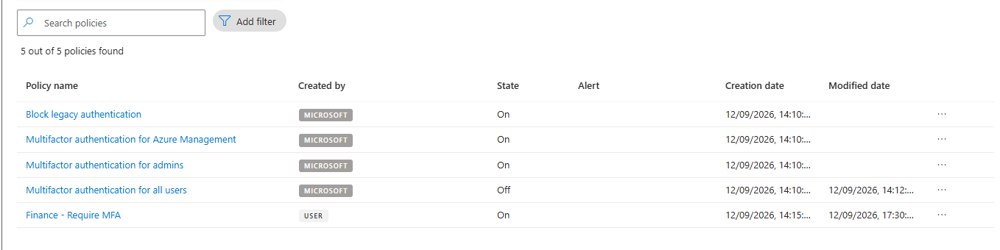
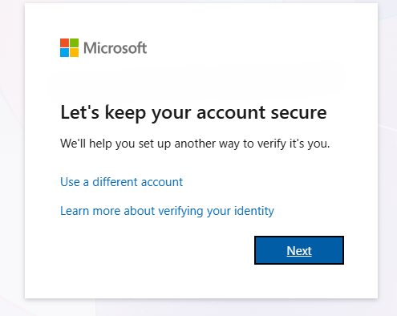
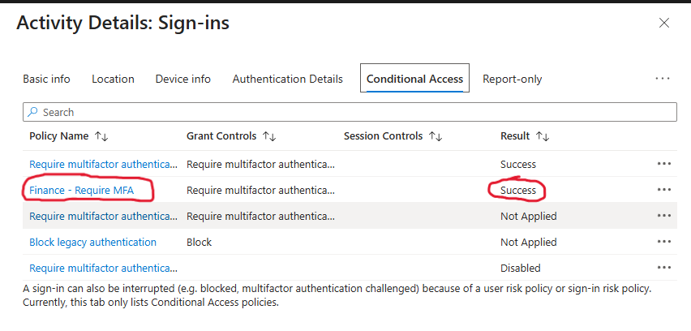

# Entra ID – Conditional Access & Sign-In Logs

## Overview

This project demonstrates the configuration and testing of a **Microsoft Entra ID Conditional Access policy**.

A Conditional Access policy was created to require **multi-factor authentication (MFA)** for users within a Finance security group.

The policy was then tested using a Finance user account, with **Entra sign-in logs** used to verify that the policy was successfully applied.

---

## Scenario

Finance user accounts require stronger authentication when accessing organisational cloud resources.

Rather than applying MFA requirements to individual users, Finance users were placed into a dedicated **Finance security group**.

A Conditional Access policy named **Finance - Require MFA** was configured to:

- Target the Finance security group
- Apply to all cloud resources
- Require multi-factor authentication
- Enforce the policy for targeted users

---

## Conditional Access Policy

The **Finance - Require MFA** policy was enabled within Microsoft Entra ID.

This provides group-based enforcement, allowing authentication requirements to be applied consistently to Finance users.

---

## MFA Enforcement

A Finance test user was used to test the policy.

During authentication, the user was required to configure an additional verification method to secure the account.

---

## Sign-In Log Investigation

Following the authentication test, the user's sign-in activity was reviewed using **Microsoft Entra sign-in logs**.

The Conditional Access details confirmed that the **Finance - Require MFA** policy had been evaluated and successfully applied to the sign-in.

This verifies the authentication flow:

**Finance User → Finance Security Group → Conditional Access Policy → MFA → Successful Sign-In**
